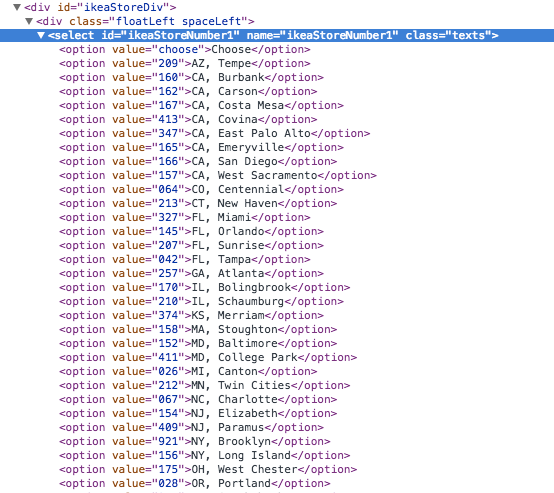

# ikeastock.py - see if a product is in stock at your local IKEA store
Say there's a product you're interested in like [NORNÄS](http://www.ikea.com/us/en/catalog/products/90286847/) here, but it isn't in stock at your local IKEA. You could bookmark the page and check back in a few weeks to see if it's available, OR you could write a really unnecessary Python module to get that same info in a machine-readable format, which is what I did.

## Usage
1. Go to the IKEA website for your region, and note the product ID from the URL of the product page you're interested in
2. If you want info for a specific store, find the ID by right-clicking on the "Check stock at your local store" menu, selecting "Inspect Element", and expanding the list:

3. If you're using an IKEA website other than the US English one, make a note of the region code in the URL (in the US, it's "us/en")
4. `python ikeastock.py product_id [-s store_id] [-r region_id]`

